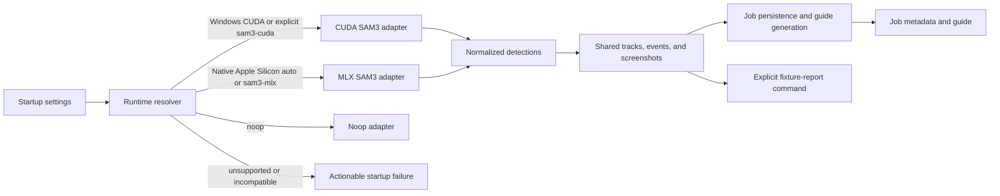

# feat: Add macOS MLX local-analysis runtime

## Summary

Add an explicit local-vision runtime selector that preserves the existing Windows CUDA/SAM3 behavior and selects a quantized MLX SAM3 runtime on native Apple-Silicon macOS. Both implementations will normalize into the current tracks, events, analysis, and guide-generation contract.

The completed work will run `testdata/IMG_3320.MOV` through the selected macOS runtime and retain a versioned, inspectable report artifact. It will not make MLX a Windows dependency or change the client-facing job schema.

---

## Problem Frame

The current local analysis runtime is CUDA-only: the bootstrap requires `nvidia-smi`, the analyzer requires `torch.cuda`, and the launcher assumes a CUDA environment. This is correct for the Windows environment where the feature was built, but it prevents the same product workflow from running locally on an Apple-Silicon Mac.

The backend already has a useful portability seam: each analyzer returns `AnalysisResult`, while the existing shared detection, tracking, event extraction, screenshot selection, persistence, and guide generation consume that normalized result. The change should isolate platform-specific model loading and raw predictor adaptation behind that seam instead of introducing platform branches into the business workflow.

## Requirements

- Preserve valid Windows startup and CUDA/SAM3 analysis as the default behavior on its existing supported environment.
- On native Apple-Silicon macOS, select a quantized MLX SAM3 runtime through a startup configuration flag with a safe `auto` default.
- Keep `noop` available for API/contract development without model dependencies.
- Reject unsupported or explicitly incompatible runtime selections before serving healthy analysis requests, with actionable diagnostics.
- Keep `JobResponse`, event semantics, guide generation, and UI behavior backend-agnostic.
- Process `testdata/IMG_3320.MOV` on the macOS runtime and save a durable, human-inspectable analysis report with runtime provenance.
- Keep model packages, virtual environments, checkpoints, cached weights, and runtime report output out of source control.

---

## Scope Boundaries

### In scope

- A platform-aware selector for `noop`, CUDA SAM3, and MLX SAM3.
- A native Apple-Silicon MLX adapter that produces the existing normalized analysis contract.
- Separate MLX provisioning/launch instructions and dependency isolation.
- Durable fixture-report generation and platform-mocked, contract-parity, persistence, and opt-in hardware coverage.

### Deferred to Follow-Up Work

- Automated CI execution of real model inference on dedicated Apple-Silicon or Windows CUDA runners.
- Accuracy tuning beyond an initial pinned-model baseline, including threshold retuning and model-quality comparisons.
- Concurrent multi-job inference, model serving, or cloud fallback.

### Out of Scope

- Replacing the existing Windows CUDA/SAM3 implementation.
- Changing the browser API contract, client workflow, or guide-review requirement.
- Downloading model weights during a user analysis request.

---

## Key Technical Decisions

| Decision | Rationale |
|---|---|
| Use `REBUILT_VISION_BACKEND=auto|noop|sam3-cuda|sam3-mlx`, with `auto` resolving to any supported CUDA host or native Apple Silicon and `sam3` retained as a CUDA-compatible alias. | It makes selection explicit without changing a valid existing CUDA deployment merely because it is not Windows. |
| Separate process liveness from analysis readiness. | Imports and liveness remain stable; `/jobs` is unavailable with a stable `503` diagnosis until the selected runtime has passed preflight. A provisioning smoke check proves that the pinned MLX model can load and perform minimal inference before the service is marked ready. |
| Keep CUDA and MLX imports lazy and implementation-specific. | MLX wheels are arm64 macOS-only; CUDA packages and `torch.cuda` must remain isolated from the Mac path. |
| Use a pinned MLX SAM3 tracking model—not a generic captioning VLM—as the macOS provider. | The application needs masks, boxes, identity continuity, and video tracking to feed its existing event pipeline. The initial candidate is `mlx-community/sam3-mxfp4`, subject to pinning a model revision and a verified MLX-VLM API before bootstrap is finalized. |
| Normalize MLX raw output to existing `Detection` objects, then reuse shared association, events, frame selection, persistence, and guide generation. | Backend identity cannot change observable track/event/guide semantics. This confines parity risk to the provider adapter. |
| Persist only an explicitly invoked fixture report outside job storage. | The requested artifact is readable and reproducible without expanding the public API or creating an unauthenticated per-job report surface. |

---

## High-Level Technical Design

The runtime resolver owns platform and dependency capability checks. Concrete adapters own model loading and raw-output conversion. The shared pipeline remains the sole authority for track IDs, event uncertainty, selected frames, and the data sent to guide generation.

---

## System-Wide Impact

- **Operators:** receive an explicit runtime, architecture, package, model-manifest, or model-location diagnosis during startup.
- **Developers:** use a dedicated macOS environment and bootstrap path without changing the Windows CUDA path.
- **End users:** retain the same upload, polling, evidence-review, and editable-guide experience on either supported platform.
- **Artifact consumers:** gain a stable report containing run provenance and normalized analysis data; no existing API fields are removed or reinterpreted.

---

## Implementation Units

### U1. Define platform-aware runtime configuration and capability resolution

**Goal:** Make local vision selection explicit, deterministic, and validated before analysis work is accepted.

**Requirements:** Cross-platform startup, unchanged Windows CUDA behavior, explicit `noop`, actionable unsupported-host errors.

**Dependencies:** None.

**Files:** `backend/app/config.py`, `backend/app/main.py`, `backend/app/vision.py`, `backend/tests/test_config.py`, `backend/tests/test_backend.py`, `.env.example`.

**Approach:** Begin with a blocking discovery spike against `mlx-community/sam3-mxfp4` and a compatible MLX-VLM release. It must prove a Python tracking API can emit per-frame masks, boxes, scores, and temporary IDs for sampled fixture frames; record exact package/model revisions plus allowlisted filenames, sizes, and checksums in a non-secret manifest. Then extend settings with backend, model location, immutable manifest, and report-location configuration, documenting defaults, precedence, valid host combinations, and sanitized provenance fields. Add a resolver/factory that maps `auto` to CUDA on any currently supported CUDA-capable host and to MLX only on native arm64 macOS. Preserve the old `sam3` configuration as a CUDA-compatible alias. Keep import/liveness stable, expose machine-readable readiness, and return a stable `503` for `/jobs` while unavailable. On Darwin, use a translation-state probe as well as interpreter architecture to distinguish Intel and Rosetta remediation.

**Patterns to follow:** `Settings.from_env` dotenv precedence in `backend/app/config.py`; the `VisionAnalyzer` protocol and application errors in `backend/app/vision.py`; `create_app` dependency injection in `backend/app/main.py`.

**Test scenarios:**
- Mock a supported CUDA capability with `auto` and verify the existing CUDA analyzer is selected.
- Mock native arm64 macOS capability with `auto` and verify the MLX analyzer is selected without importing CUDA dependencies.
- Verify explicit `noop` starts on every host and injected processors still bypass real model setup in unit tests.
- Verify invalid backend values and explicit CUDA-on-macOS / MLX-on-unsupported-host selections preserve liveness but make readiness and `/jobs` unavailable with stable error codes and remediation text.
- Verify Intel macOS and Rosetta/x86 Python on Apple Silicon return distinct diagnostics.
- Verify an absent MLX package, unavailable Metal, missing model manifest, or failed model preflight fails deterministically while process environment values still override dotenv values.

**Verification:** Supported mocked platforms resolve exactly one eligible analyzer; impossible configurations keep liveness stable but do not expose analysis-ready state or accept uploads. The selected MLX package/model pair is not implemented until its raw-output contract is pinned and verified.

### U2. Add a quantized MLX SAM3 provider adapter

**Goal:** Run local MLX SAM3 inference on Apple Silicon and convert its raw predictions into the current application detection semantics.

**Requirements:** MLX-only macOS dependency path; parity of tracks, events, analysis provenance, and downstream guide inputs.

**Dependencies:** U1.

**Files:** `backend/app/vision.py`, `backend/app/vision_worker.py`, `backend/tests/test_vision.py`, `backend/tests/test_backend.py`, `pyproject.toml`, `requirements.txt`.

**Approach:** Add an MLX-specific analyzer behind the existing `VisionAnalyzer` interface using U1's verified package/model pair. Lazy-load MLX only after U1 has verified native Apple-Silicon capability and an immutable local snapshot. Define the adapter contract before coding: prompts are the existing `LEGO piece` and `hand`; sampled frame indexes map to extracted-frame indexes; masks and boxes normalize into extracted-frame pixel coordinates; provider IDs are temporary and the shared associator owns durable IDs; empty frames stay empty; and each window is independently initialized before the existing stitcher reconciles boundaries. Keep shared contact clustering, uncertainty rules, event detection, and screenshot selection unchanged. Populate `AnalysisInfo` with exact backend/model/quantization/revision provenance.

**Execution note:** Start with fake-provider contract tests before installing or invoking the real model.

**Patterns to follow:** `Sam3VisionAnalyzer` worker boundary and raw-output normalization in `backend/app/vision.py`; JSON worker payload conventions in `backend/app/vision_worker.py`; existing event and track behavior tests in `backend/tests/test_vision.py`.

**Test scenarios:**
- Convert representative MLX predictions into valid `Detection` objects with normalized masks, boxes, IDs, concepts, and scores.
- Prove representative CUDA and MLX normalized results satisfy the same structural assertions for event ordering, frame references, timestamps, tracks, metrics, and `AnalysisInfo` provenance.
- Handle empty detections, malformed boxes/masks/scores, model exceptions, and incomplete inference output without persisting invalid contract data.
- Preserve current behavior for occlusion, ID churn, overlapping windows, long gaps, contact-only assembly evidence, attach/detach transitions, and screenshot selection.
- Verify package imports remain lazy so Windows tests and startup do not require MLX, and macOS adapter tests do not require CUDA.

**Verification:** A fake MLX provider can traverse the existing shared event pipeline and produce a result indistinguishable from CUDA at the public contract boundary except for analysis provenance.

### U3. Add isolated macOS provisioning and startup paths

**Goal:** Make the correct local runtime easy to install and run without perturbing the existing Windows CUDA setup.

**Requirements:** Native arm64-only MLX environment, pinned local model, no request-time download, preserved Windows launch behavior.

**Dependencies:** U1, U2.

**Files:** `scripts/bootstrap_mlx_sam3.sh`, `scripts/run_backend_mlx.sh`, `scripts/run_backend.sh`, `.gitignore`, `README.md`, `.env.example`, `pyproject.toml`, `requirements.txt`.

**Approach:** Add a macOS bootstrap that verifies native arm64 Python, Rosetta state, and Metal availability; creates a separate MLX environment; and installs only U1's exact package set. Download into a service-owned private staging directory, validate the allowlisted files, checksums, and sizes, atomically promote the snapshot, then write the manifest last. Reject symlinks and group/world-writable cache locations; keep directories private and never log token values or token-file paths. Add a bounded model-load/minimal-inference preflight command whose successful manifest entry gates readiness. Update the launcher so platform selection is visible and backward-compatible. Leave CUDA bootstrap and its Windows assumptions intact. Ignore the MLX environment, model cache, and fixture report output.

**Patterns to follow:** environment overrides, token handling, and preflight shape in `scripts/bootstrap_sam3.sh`; launcher configuration in `scripts/run_backend.sh`; configuration guidance in `README.md`.

**Test scenarios:**
- With stubbed Python, package installer, and downloader, verify arm64/Rosetta rejection, manifest creation, expected permissions, failed-download cleanup, launcher environment selection, checksum mismatch rejection, and redacted failures.
- Verify documentation specifies the native Python/Rosetta failure mode, platform-specific setup, model location, and how to select `auto`, CUDA, MLX, or noop.
- Verify the bootstrap contract prevents missing model/package errors from being discovered only after a job upload.

**Verification:** A developer can provision a separate Mac environment with a pinned MLX model and start the backend through the selected runtime without requiring CUDA or changing a valid Windows setup.

### U4. Persist reproducible fixture-report output

**Goal:** Retain an inspectable report for the test video without changing the public job API or creating a new report endpoint.

**Requirements:** Process `testdata/IMG_3320.MOV`, save human-inspectable output, include runtime provenance, avoid secrets and partial-report corruption.

**Dependencies:** U1, U2.

**Files:** `scripts/benchmark_sam3.py`, `scripts/generate_fixture_report.py`, `backend/tests/test_vision.py`, `backend/tests/test_video_fixture.py`, `README.md`, `.gitignore`.

**Approach:** Define a versioned JSON analysis-report schema containing a sanitized source basename/content hash, extraction facts, selected runtime/model/configuration, completion state, and validated analysis/tracks/events. Do not include guides, job IDs, raw prompts, exception strings, headers, token values, token-file paths, or environment dumps. Make benchmark tooling backend-neutral and require an explicit output path. The fixture command writes atomically to an ignored `reports/` destination keyed by fixture basename and immutable model revision; it refuses to overwrite a completed report unless an explicit replacement flag is supplied. A failed run leaves either no final report or an atomically written failed report for that attempt, never overwriting a completed artifact. The existing job metadata and guide path remain unchanged and are not report-served.

**Patterns to follow:** atomic JSON writes in `backend/app/storage.py`; analysis-to-guide sequencing and event-pair batching in `backend/app/processing.py`; benchmark structure in `scripts/benchmark_sam3.py`.

**Test scenarios:**
- Persist a successful report atomically and assert its provenance, schema version, sanitized source identity, result shape, and event frame references match the validated analysis result.
- Ensure an invalid analyzer result cannot produce a falsely complete report.
- Ensure runtime failure cannot replace a prior completed report and replacement behavior requires an explicit flag.
- Verify the report excludes tokens, absolute secret paths, and environment dumps.
- Verify fixture tooling honors an explicit output path, never requires guide credentials, and excludes sensitive material.

**Verification:** A completed fixture run leaves a parseable report that identifies the MLX model/runtime and allows a reviewer to inspect tracks, events, selected evidence, and uncertainty without rerunning inference.

### U5. Add portability, persistence, and hardware-acceptance coverage

**Goal:** Keep the cross-platform selection and report contract reliable while separating portable tests from provisioned-hardware validation.

**Requirements:** Windows regression protection, MLX contract parity, real test-video acceptance, no mandatory model downloads in portable CI.

**Dependencies:** U1, U2, U3, U4.

**Files:** `backend/tests/test_config.py`, `backend/tests/test_backend.py`, `backend/tests/test_vision.py`, `backend/tests/test_video_fixture.py`, `backend/tests/test_mlx_integration.py`, `README.md`.

**Approach:** Expand portable tests using injected platform and provider probes; keep the real test video/model path opt-in and skipped unless the selected runtime, pinned model, and fixture are available. Establish a manual macOS acceptance procedure that always creates the analysis report from `testdata/IMG_3320.MOV` without requiring guide credentials. Record elapsed time, memory or a documented observable proxy, input resolution/FPS/window size, and failure class. After the first pinned baseline, check in reviewed non-sensitive invariants and a non-regression ceiling rather than relying only on report existence or a fixed event count.

**Patterns to follow:** fixture extraction test in `backend/tests/test_video_fixture.py`; fake extractor/analyzer/generator style in `backend/tests/test_backend.py`; vision behavior tests in `backend/tests/test_vision.py`.

**Test scenarios:**
- Verify portable suites do not import/download MLX or CUDA assets yet cover all resolver and contract states through fakes.
- On a provisioned native Apple-Silicon runner, process the fixture without API credentials and verify the report exists, parses, names `sam3-mlx`, records pinned provenance, contains extraction metrics, and references only valid frame IDs.
- Verify the report meets reviewed baseline invariants for non-empty evidence where appropriate, runtime/resource envelope, schema, event ordering, and uncertainty representation.
- On the Windows configuration, verify startup continues selecting CUDA and existing worker semantics remain unchanged.
- Verify a server restart during active analysis retains the current interrupted-job behavior and no report claims completion.

**Verification:** The portable suite protects selection, normalization, and report behavior; the opt-in hardware run demonstrates actual macOS MLX execution and creates the requested report artifact without an OpenAI key.

---

## Risks and Mitigations

| Risk | Mitigation |
|---|---|
| MLX-VLM SAM3 APIs vary across releases. | Pin a tested MLX-VLM revision and model snapshot; test the Python API during bootstrap and adapter integration. |
| A generic quantized VLM cannot preserve segmentation/tracking semantics. | Use a quantized MLX SAM3 tracking provider and normalize into the established detection path. |
| A Rosetta/x86 Python on Apple Silicon cannot install MLX correctly. | Detect interpreter and translation state before provisioning or readiness, then prescribe an arm64 Python environment. |
| MLX inference exhausts unified memory or stalls concurrent work. | Reuse the current one-active-job limit; bound frame rate/resolution/window size; retain timeout and failed-job handling. |
| MLX output diverges from CUDA event quality. | Preserve shared event logic and baseline fixture acceptance against a pinned revision before tuning thresholds. |
| A report leaks sensitive runtime configuration. | Limit it to non-secret provenance and validated analysis data; omit token values, environment dumps, and secret paths. |

---

## Deferred Implementation Questions

- Confirm the exact MLX-VLM SAM3 Python tracking API and pin a compatible package revision before writing the provider adapter. If its raw output cannot expose masks, boxes, IDs, and per-frame tracking data, stop and select a compatible MLX SAM3 build rather than parsing rendered video output.
- Decide the final cache location policy for the pinned MLX model outside source control while keeping it configurable for offline use.
- Baseline fixture output on the target M2 before choosing a fixed quality threshold or expected event count.

---

## Sources & Research

- Apple MLX installation and native-Python requirements: https://ml-explore.github.io/mlx/build/html/install.html
- MLX-VLM Python load/generate and runtime guidance: https://github.com/Blaizzy/mlx-vlm/blob/main/docs/usage.md
- MLX-VLM loading/cache behavior: https://github.com/Blaizzy/mlx-vlm/blob/main/README.md
- Hugging Face pinned snapshot download guidance: https://huggingface.co/docs/huggingface_hub/en/guides/download
- Existing implementation patterns: `backend/app/config.py`, `backend/app/main.py`, `backend/app/vision.py`, `backend/app/processing.py`, `backend/app/storage.py`, `scripts/bootstrap_sam3.sh`, and `backend/tests/`.
