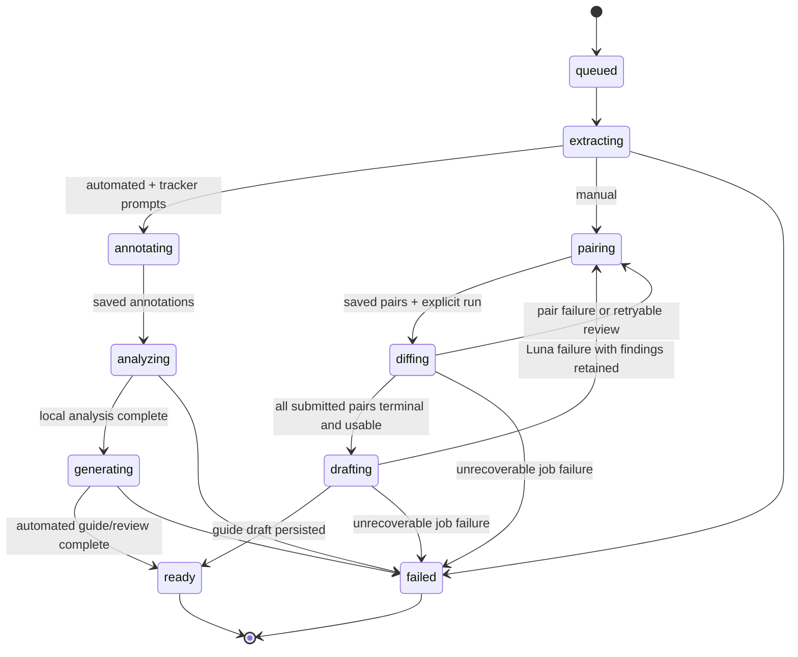

# feat: Add manual pairwise instruction mode

## Summary

Add a second Rebuilt workflow for manually selecting before/after frame pairs from a disassembly video. Each saved pair is reviewed independently by `gpt-6-astra` as a compact visual-difference task; only validated pair findings are passed to `gpt-5.6-luna` to draft an editable assembly guide. Both workflows remain in the same application and share the job shell, canonical frame chronology, guide editor, save contract, and failure handling.

This plan is grounded in `docs/brainstorms/2026-09-20-001-feat-shared-mode-ui-requirements.md`, which is the behavioral source of truth for the shared UI and manual workflow.

---

## Problem Frame

Rebuilt currently models one upload-to-guide lifecycle with an automated analysis path and an interactive annotation pause for backward tracking. The requested manual path has a different interaction boundary: the user, rather than the tracker, chooses the evidence for each physical change. Treating those selections as ordinary local events would lose provenance, make polling unsafe, and force the UI to infer assembly chronology from source-frame positions.

The implementation must therefore add a mode-aware job contract, an explicit interactive `pairing` state, durable manual pairs, a bounded two-stage model pipeline, and a shared UI state model without changing the meaning of existing automated `tracks`, `events`, or guide data.

The plan carries forward the origin actors: the builder/reviewer needs a recoverable evidence-to-guide workspace; the parallel UI implementer needs stable fixtures and state semantics before live model calls exist; and the backend/model pipeline owns frame identity, persistence, validation, model boundaries, and sanitized failure reporting.

---

## Requirements Traceability

The plan carries forward the origin document's requirements and acceptance examples:

- **Shared job and timeline:** R1, R2, R3, R4, and R5 establish immutable mode identity, stable frame references, server-owned source/assembly chronology, shared guide editing, and historic-job compatibility.
- **Manual workflow:** R6, R7, R8, R9, R10, R11, R12, and R13 establish pair structure, validation, non-destructive editing, explicit execution, bounded Astra review, compact Luna handoff, per-pair review states, and degraded completion.
- **Automated parity:** R14, R15, and R16 require the existing annotation/backward-tracking flow to remain intact while sharing evidence vocabulary and accessibility behavior.
- **User flows:** F1, F2, F3, and F4 cover mode selection, automated analysis, manual pair selection/two-stage generation, and resume/failure/reset behavior.
- **Acceptance examples:** AE1–AE7 cover dirty pair preservation, assembly semantics, the two-stage payload boundary, partial provider failure, historic automated compatibility, shared guide saving, and reset isolation.

---

## Scope Boundaries

### In scope

- Mode selection before upload and immutable `automated`/`manual` job identity.
- Canonical frame metadata for raw source time and assembly/build chronology.
- A durable manual-pair contract and interactive `pairing` lifecycle.
- Pair-scoped Astra visual-difference requests with strict structured output and bounded image inputs.
- Luna drafting from compact validated pair findings, with no original images in the drafting request.
- Pair-level progress, uncertainty, retry, and degraded-result states.
- Shared browser state, timeline controls, guide editing, saving, reset, and historic-job compatibility.
- Contract fixtures and deterministic fake providers so backend and UI agents can work in parallel.

### Deferred to Follow-Up Work

- Automatic suggestions for likely change points.
- Fine-grained LEGO part, color, stud-count, or orientation recognition.
- A user-facing low/high image-detail selector.
- Whole-video multimodal requests or direct video uploads to a model.
- Collaborative editing, comments, or live multi-user presence.
- Automatic re-running after every guide edit.

### Outside this product's identity

- A general-purpose video editor.
- A freeform computer-vision labeling platform.
- A fully autonomous instruction publisher that bypasses human review.

---

## Key Technical Decisions

1. **Use a separate manual workflow state machine.** Add `pairing`, `diffing`, and `drafting` states rather than overloading automated `annotating` or `events`. `pairing` is interactive and non-active; `diffing` and `drafting` are active and must be recoverable as interrupted jobs.

2. **Make chronology server-owned.** New extracted frames expose stable source identity plus canonical assembly/build time. Manual pairs always carry semantic `beforeFrameId` and `afterFrameId`; the browser never reconstructs reverse chronology from array positions. This follows the existing reverse-disassembly rule and prevents a valid pair from becoming an inverted instruction.

3. **Keep manual evidence separate from automated evidence.** Store `manualPairs` and `manualReview` beside, not inside, local `tracks` and automated `events`. This keeps user-selected evidence, local detector output, and model interpretation independently inspectable.

4. **Use pair-scoped Astra calls.** Send one bounded labelled before/after pair per request. This costs more request overhead than one large batch, but it isolates failures, supports exact pair-level retries, and satisfies the required partial-failure behavior. Minimize input cost with a short stable prompt prefix, a low-detail image setting by default, resized JPEG evidence, and provider usage metrics; make higher detail an operator configuration for later fixture comparison.

5. **Make the Astra→Luna boundary explicit.** Astra returns a compact, schema-validated finding tied to one pair. Luna receives only those findings, pair chronology, and allowable frame IDs. Luna never receives the original images, uploaded video, local filesystem paths, or unvalidated model text.

6. **Validate references at the application boundary.** Strict structured output is necessary but insufficient. The backend must reject unknown pair IDs, frame IDs, unsupported enum values, missing required fields, invalid confidence, and findings that cite frames outside their submitted pair. A single correction retry is allowed; failures remain reviewable rather than becoming instructions.

7. **Reuse the existing provider boundary without duplicating transport policy.** The manual providers should share the existing Responses API timeout, API-key handling, error mapping, and redaction conventions. The shared transport/schema helpers should be coordinated with `docs/plans/2026-09-19-002-feat-llm-detection-review-plan.md` so the two plans do not create competing OpenAI clients.

8. **Use revision- and run-guarded writes.** Persist a monotonically increasing job revision with pair changes and require the client to send the revision it last read. A stale pair save returns a conflict without overwriting the newer server snapshot. Starting analysis mints an `analysisRunId`; every background transition and pair result must match that run before it can persist. Repository updates must serialize read-modify-write operations and support conditional status/run transitions, so duplicate run requests and stale workers cannot overwrite a newer snapshot. The UI still stops polling at `pairing`; the revision guard protects explicit writes and reload races.

---

## High-Level Technical Design

The diagrams below are authoritative descriptions of the intended boundaries and sequencing.

### Mode and data-flow architecture

```mermaid
flowchart LR
    Upload[Mode chooser + upload] --> Extract[Shared frame extraction]
    Extract --> Branch{Job mode}
    Branch -->|automated| Annotate[Named-part annotation]
    Annotate --> Track[Backward tracker]
    Track --> Events[Automated tracks/events]
    Events --> AutoReview[Existing event review]
    AutoReview --> Guide[Shared guide draft/editor]

    Branch -->|manual| Pairing[Manual pairing workspace]
    Pairing --> SavedPairs[Durable manualPairs]
    SavedPairs --> Astra[One labelled pair to Astra]
    Astra --> Findings[Validated PairFindings]
    Findings --> Luna[Compact findings to Luna]
    Luna --> Guide

    Guide --> Save[Shared guide validation/save]
```



### Job lifecycle and terminal states



`pairing` is an interactive pause and is not included in background `ACTIVE_STATUSES`, but interactive states (`annotating` and `pairing`) still participate in job-admission locking so a second upload cannot compete with the current user's review. `diffing` and `drafting` are active processing states and are marked interrupted after a server restart, while the saved pair list and completed findings remain on disk. Existing automated annotation state remains restorable rather than being treated as an interrupted background job.

### Two-stage model boundary

```mermaid
sequenceDiagram
    participant UI as Browser
    participant API as FastAPI job API
    participant Store as Atomic job repository
    participant A as Astra pair reviewer
    participant L as Luna guide drafter

    UI->>API: save pairs with expected revision
    API->>Store: persist manualPairs + new revision
    UI->>API: run manual analysis
    API->>Store: conditional pairing→diffing; mint analysisRunId
    loop each saved pair
        API->>A: pairId + before/after image blocks + compact instructions
        A-->>API: strict PairFinding or provider error
        API->>Store: persist pair result only when analysisRunId matches
    end
    alt every pair is usable or explicitly needs review
        API->>Store: status=drafting
        API->>L: compact findings + chronology + allowed frame IDs
        L-->>API: strict Guide draft
        API->>Store: persist guide + manualReview + status=ready
    else a pair failed
        API->>Store: status=pairing with retryable pair error
    end
    API-->>UI: pollable job snapshot
```

---

## System-Wide Impact

- **Backend:** `JobStatus`, `JobResponse`, frame metadata, persistence, route guards, and processing orchestration gain mode-aware fields. Existing automated defaults and no-mode historic records remain valid.
- **Model pipeline:** Configuration gains separate diff and drafting roles, bounded image settings, and manual-stage timeouts. Raw detector events remain immutable; manual findings are a separate provenance layer.
- **Frontend:** The reducer and API client gain mode/pair/review state while preserving the existing dirty-guide rule. The workspace becomes a shared shell with mode-specific controls and terminal states.
- **Contracts and fixtures:** The JSON Schema and fixtures must represent interactive statuses and optional manual fields, while accepting legacy automated payloads.
- **Operations:** OpenAI readiness diagnostics must distinguish missing configuration, unsupported model access, timeout, invalid output, and partial pair failure without exposing keys, headers, raw prompts, or filesystem paths.
- **Parallel delivery:** The UI agent can implement against manual pairing/review fixtures after U1. Backend units U2–U4 can use deterministic fake providers and do not require the live models for contract or lifecycle coverage.

---

## Implementation Units

### U1. Establish the mode-aware job and evidence contract

**Goal:** Define the shared backend/frontend data model for modes, canonical frame chronology, manual pairs, pair findings, and review lifecycle without breaking historic automated jobs.

**Requirements:** R1–R6, R15; supports F1–F3 and AE2, AE5.

**Dependencies:** None.

**Files:**

- `backend/app/models.py`
- `backend/app/storage.py`
- `contracts/job.schema.json`
- `contracts/README.md`
- `contracts/fixtures/manual-pairing.json`
- `contracts/fixtures/manual-partial-review.json`
- `contracts/fixtures/legacy-automated-ready.json`
- `backend/tests/test_manual_contract.py`
- `backend/tests/test_backend.py`

**Approach:**

- Add an explicit job mode with automated as the compatibility default when older metadata has no mode.
- Add manual lifecycle states and a manual review envelope without changing the meaning of automated `events`, `tracks`, `analysis`, or `guide`.
- Extend new frame output with canonical source index and assembly/build time. Keep old persisted frames readable by treating the new metadata as absent until the next extraction or migration boundary; the API must not make the browser infer it.
- Model each pair with stable `pairId`, `sequence`, `beforeFrameId`, and `afterFrameId`. Model pair findings with a closed status, compact difference, uncertainty, confidence, and evidence references. Keep raw model text out of persisted public responses.
- Add a job revision for guarded manual writes and an `analysisRunId` for conditional background writes. Serialize repository read-modify-write updates rather than relying on atomic file replacement alone, and retain the interrupted-job policy.
- Update the contract schema and fixtures together. Optional manual fields must remain absent/null-safe for automated fixtures; `pairing` must be a valid status in the public contract.

**Patterns to follow:**

- Pydantic models and `Literal` status unions in `backend/app/models.py`.
- Atomic metadata writes and restart handling in `backend/app/storage.py`.
- Camel-case JSON contract and `additionalProperties: false` conventions in `contracts/job.schema.json`.
- Existing fixture-driven frontend/API tests in `contracts/fixtures/` and `backend/tests/test_backend.py`.

**Test scenarios:**

- **Happy path:** Serialize a manual job with frame chronology, one saved pair, and an empty manual review; deserialize it with the exact pair and frame identifiers intact.
- **Happy path:** Serialize a completed manual review with `completed`, `needs_review`, and `failed` pair states without changing the shared `Guide` shape.
- **Edge case:** Load historic job metadata with no `mode`, `manualPairs`, `manualReview`, revision, or assembly-time fields; expose automated defaults and do not raise a validation error. Covers AE5.
- **Edge case:** Verify source time and assembly time are distinct values and that the assembly timeline is monotonic for a reverse-disassembly frame list. Covers AE2.
- **Error path:** Reject an unknown manual status, duplicate pair ID, malformed finding status, confidence outside `[0, 1]`, or extra contract property.
- **Integration:** Persist and reload a manual job through `JobRepository`; confirm atomic updates retain the pair list, revision, and completed findings after reopening the repository.
- **Integration:** Concurrent progress, pair-result, and guide-metadata updates preserve all unrelated fields; an update carrying an obsolete `analysisRunId` is rejected without changing the current run.
- **Integration:** Reopen jobs in `diffing` and `drafting`; mark them interrupted while leaving the saved pair list and already persisted pair findings available for retry.

**Verification:** The API contract describes every new field, legacy fixtures remain valid, and a manual job can round-trip through repository persistence without losing chronology or provenance.

---

### U2. Add manual pairing endpoints and lifecycle guards

**Goal:** Let the browser save, edit, reorder, and explicitly run manual pairs while protecting interactive drafts from stale or invalid writes.

**Requirements:** R7–R9, R14; supports F1, F3, F4 and AE1, AE6, AE7.

**Dependencies:** U1.

**Files:**

- `backend/app/main.py`
- `backend/app/processing.py`
- `backend/app/storage.py`
- `backend/tests/test_manual_mode.py`
- `backend/tests/test_backend.py`
- `web/src/api.js`
- `web/tests/api.test.mjs`

**Approach:**

- Accept mode at job creation, defaulting omitted mode to automated for existing clients.
- Add a pair-save endpoint available only in `pairing`. Validate all frame references against extracted frames, pair role completeness, unique IDs, sequence normalization, revision, and supported assembly chronology before replacing the saved list.
- Add an explicit run endpoint available only after a successful pair save with at least one pair. Atomically transition `pairing` to `diffing` while minting an `analysisRunId` before launching the manual processor; a duplicate request then observes the new status and cannot launch a second worker. Do not start model work merely because pairs were edited.
- Keep `pairing` outside the background-processing set so the user can inspect/edit while the server is idle, but add an admission lock covering both interactive states (`annotating`, `pairing`) and active processing states. Keep `diffing` and `drafting` inside the existing one-active-job guard.
- Return pair-level validation errors that identify the bad pair while preserving the last valid server snapshot. A stale revision returns a conflict rather than silently overwriting newer pairs.
- Extend the live API client and polling stop set to include `pairing`; preserve the existing no-mock-fallback behavior and abort semantics.

**Execution note:** Start with route/state characterization tests for the existing `annotating` pause and dirty-state behavior before adding manual statuses, because the manual flow must not regress the current interactive boundary.

**Patterns to follow:**

- Route guards, `AppError`, and sanitized `error_payload` in `backend/app/main.py`.
- `JobCoordinator` background-thread startup and `ACTIVE_STATUSES` handling in `backend/app/main.py`.
- Explicit save semantics and polling cancellation in `web/src/api.js`.
- Existing annotation validation and `track` endpoint as the closest lifecycle pattern.

**Test scenarios:**

- **Happy path:** Create a job with `mode=manual`, poll it to `pairing`, save two valid pairs, and confirm the response preserves order, revision, and frame references.
- **Happy path:** Replace, remove, and reorder pairs, then run analysis; confirm the run is rejected before save and accepted after a non-empty valid save. Covers AE1.
- **Edge case:** While a client has a dirty three-pair draft, a poll returns the unchanged server pair list; reducer/API behavior keeps the dirty draft and remains in `pairing`. Covers AE1.
- **Edge case:** A second save with an old revision returns a conflict and does not change the newer server pair list.
- **Edge case:** Two near-simultaneous run requests yield exactly one accepted run and one stable state-conflict response; only the accepted run ID may write later pair results.
- **Edge case:** A second upload while another job is `annotating` or `pairing` returns the existing busy error, while pair edits on the interactive job remain allowed.
- **Error path:** Reject unknown frame IDs, identical before/after frames, duplicate pair IDs, empty pair lists, invalid mode, run from `ready`, and run with unsaved/empty pairs using stable error codes.
- **Error path:** Abort polling at `pairing`, `ready`, or `failed`; do not enter mock mode after a live HTTP error. Covers AE7.
- **Integration:** Submit a valid pair list, start the run, and verify the persisted job moves to `diffing` with the same saved pairs before any model result exists.
- **Integration:** Reload a saved manual job through the API client and restore mode, pairs, review state, and guide draft without showing automated annotation controls. Covers AE7.

**Verification:** Manual jobs pause deterministically at `pairing`, pair writes are revision-safe and non-destructive, explicit run is the only path into model processing, and automated route behavior remains unchanged.

---

### U3. Implement pair-scoped Astra visual difference review

**Goal:** Convert each selected before/after pair into one compact, validated visual-difference finding while minimizing image and prompt tokens.

**Requirements:** R10, R12–R13; supports F3, F4 and AE3, AE4.

**Dependencies:** U1, U2.

**Files:**

- `backend/app/manual_processing.py`
- `backend/app/processing.py`
- `backend/app/config.py`
- `backend/tests/test_manual_processing.py`
- `backend/tests/test_manual_mode.py`
- `contracts/fixtures/manual-pair-review.json`

**Approach:**

- Add a focused manual-processing provider boundary rather than embedding pair-specific prompt construction inside the route handler.
- Resolve both frame IDs from the repository, resize evidence to the existing image bounds, and send exactly two labelled image blocks with `pairId`, role, frame ID, raw timestamp, and assembly time. Do not send the full video or filesystem paths.
- Use `gpt-6-astra` as the initial configurable diff-model default. Use a short stable instruction prefix, low image detail as the initial operator default, a bounded output size, and no arbitrary user notes in the prompt. Keep high detail available as a server setting for fixture-driven quality comparison.
- Require strict structured output with one finding for the submitted pair. The finding should describe only the visible change, use a closed action/uncertainty vocabulary, cite only the submitted frame IDs, and avoid invented part identities or claims not supported by the images.
- Persist each pair result immediately after its request, conditioned on the current `analysisRunId`. A provider error affects only that pair and remains retryable; completed pairs are not re-requested unless the user explicitly retries them.
- Record provider model, image detail, request count, and returned usage fields when available. Redact raw prompts, API headers, and provider response bodies from persisted job data.
- Reuse the existing OpenAI Responses transport/error conventions and coordinate shared helpers with the automated post-processing plan.

**Test scenarios:**

- **Happy path:** A fake Astra provider receives one labelled before/after pair and returns a valid compact finding whose pair ID and evidence frame IDs match the request. Covers AE3.
- **Happy path:** Three pairs produce three independent findings, each persisted immediately in pair order; the second request does not include images or labels from the first pair.
- **Edge case:** Adjacent pairs share a frame; each request still labels the shared image according to its current pair/role, and no array position is used as identity.
- **Edge case:** Low-detail configuration changes the image input metadata without changing pair IDs, frame IDs, or schema validation.
- **Error path:** Astra returns unknown pair IDs, unknown frame IDs, missing required fields, invalid action values, unsupported claims, or confidence outside `[0, 1]`; the result is rejected and retried at most once.
- **Error path:** A timeout or provider error on pair three leaves pairs one and two completed, marks pair three retryable, and does not fabricate a guide step. Covers AE4.
- **Error path:** Missing API configuration, oversized evidence, and an unavailable model produce sanitized pair/job errors without persisting raw provider output.
- **Integration:** A manual run writes `diffing`, invokes the fake provider once per selected pair, persists each result, and returns to a retryable pairing/review state when any pair fails.
- **Integration:** Start a replacement run, then deliver a delayed result from the prior run; verify the stale result cannot alter the current pair status, findings, guide, or job status.

**Verification:** Every submitted pair has one explicit terminal/retryable result, the provider payload contains only the bounded labelled pair, invalid output cannot cross into guide drafting, and usage/provenance data is inspectable without secrets.

---

### U4. Draft a guide from compact findings with Luna

**Goal:** Turn validated manual pair findings into the existing editable `Guide` contract without sending original images to the drafting model.

**Requirements:** R11–R13, R15; supports F3, F4 and AE3, AE4, AE6.

**Dependencies:** U3.

**Files:**

- `backend/app/manual_processing.py`
- `backend/app/processing.py`
- `backend/app/config.py`
- `backend/tests/test_manual_processing.py`
- `backend/tests/test_manual_mode.py`
- `contracts/fixtures/manual-ready.json`
- `contracts/fixtures/manual-luna-failure.json`

**Approach:**

- Start Luna only when all submitted pairs have terminal findings and no pair is in an unrecoverable failed state. If Astra has a failed pair, stop after diffing and let the user retry rather than drafting a falsely complete guide.
- Send only compact validated findings, ordered pair chronology, allowed frame references, uncertainty, and guide-writing constraints. The payload contains no image blocks, video bytes, local paths, raw Astra text, or unknown identifiers.
- Use `gpt-5.6-luna` as the initial configurable drafting-model default. Require strict structured output matching the existing guide schema and validate each output frame reference against the extracted frame set.
- Preserve pair provenance in `manualReview` even when the guide merges or omits a finding. A `needs_review` finding may produce an explicitly uncertain draft step; a failed finding may not produce a step.
- Persist `drafting` before the Luna request and `ready` only after guide validation. If Luna fails, preserve completed findings and expose an editable/manual recovery state instead of discarding evidence.
- Keep the existing `PUT /jobs/{job_id}/guide` save path as the final human-approved boundary.

**Test scenarios:**

- **Happy path:** Valid completed findings for two ordered pairs produce a guide with valid extracted frame references, preserved assembly order, and pair-linked review metadata. Covers AE3.
- **Happy path:** A `needs_review` finding produces a guide step with explicit uncertainty and remains editable rather than being presented as verified.
- **Edge case:** Repeated or shared frame IDs across findings remain valid when the guide references extracted frames and pair provenance remains deduplicated.
- **Edge case:** A completed finding with a missing optional uncertainty is normalized without inventing certainty text.
- **Error path:** Luna returns a missing step, unknown frame ID, extra unrecognized field, or invalid structured output; the job remains reviewable and no invalid guide is persisted.
- **Error path:** Luna times out or is unavailable after Astra succeeds; pair findings remain visible, the user can edit/create a guide manually, and the UI does not claim automatic completion. Covers AE4.
- **Integration:** A complete manual run transitions `diffing → drafting → ready`, persists `manualReview`, returns the shared `Guide`, and allows the existing guide save endpoint to save an edited title/step. Covers AE6.

**Verification:** Luna sees only compact validated data, every guide frame reference is server-validated, uncertain/failed evidence cannot become a verified instruction, and a drafting failure preserves enough data for manual recovery.

---

### U5. Rebuild the shared browser workspace for both modes

**Goal:** Implement the mode-aware UI, manual pair scrubber/review surface, shared guide editor, and safe state transitions against the contract and fixtures so a second UI agent can work in parallel with backend implementation.

**Requirements:** R1–R5, R8–R16; supports F1–F4 and AE1–AE7.

**Dependencies:** U1 for contract/fixtures; U2 for endpoint names and lifecycle semantics. U3/U4 may be stubbed with fixtures while UI work proceeds.

**Files:**

- `web/index.html`
- `web/styles.css`
- `web/src/app.js`
- `web/src/api.js`
- `web/src/state.js`
- `web/src/mock-fixtures.js`
- `web/tests/state.test.mjs`
- `web/tests/api.test.mjs`
- `web/tests/manual-fixtures.test.mjs`
- `web/README.md`

**Approach:**

- Preserve the existing plain HTML/CSS/JavaScript architecture and restrained editorial visual language. Do not introduce a component framework or a second token system.
- Add a mode chooser before upload and make mode visible in the workspace header. Keep the upload shell, progress messaging, error panel, reset behavior, and guide editor shared.
- Add a manual pairing workspace with an extracted-frame timeline, current frame preview, raw source and assembly/build time labels, explicit `Set before` / `Set after` controls, ordered pair list, replace/remove/reorder actions, and an explicit `Analyze selected changes` action.
- Keep `savedManualPairs` and `draftManualPairs` separate. `JOB_UPDATE` at `pairing` must preserve a dirty pair draft just as it preserves a dirty guide draft. `SAVE_PAIRS_SUCCEEDED` replaces the server snapshot and clears pair dirtiness; conflicts preserve the local draft and display a retry/refresh choice.
- Render pair-level `pending`, `completed`, `needs_review`, and `failed` states with text, icon, and color distinctions. Show compact differences and uncertainty adjacent to the relevant pair. Do not show manual controls in automated mode.
- Reuse the existing guide reducer/validation/save behavior for both modes. A model failure must not clear guide edits or silently switch a live job into mock mode.
- Use semantic buttons/labels, keyboard-operable timeline controls, visible focus states, status announcements, and text alternatives for evidence images. Keep copy factual and action-oriented.
- Build UI tests against contract fixtures first. The UI agent can work before live model calls exist by using manual pairing, partial-review, manual-ready, Luna-failure, legacy automated, and live-failure fixtures.

**Execution note:** Implement reducer/API contract tests against fixtures before changing markup. This lets the parallel UI agent prove dirty-draft, polling, and failure semantics without waiting for backend model integration.

**Patterns to follow:**

- Existing state reducer and dirty-draft preservation in `web/src/state.js`.
- Existing polling, upload, save, and `ApiError` behavior in `web/src/api.js`.
- Current evidence/timeline/annotation interaction patterns in `web/src/app.js` and `web/index.html`.
- Existing spacing, typography, color, focus, and responsive behavior in `web/styles.css`.
- Mock-mode isolation and fixture persistence in `web/src/mock-fixtures.js`.

**Test scenarios:**

- **Happy path:** Select manual mode, upload a video, reach `pairing`, set before/after frames, save an ordered pair list, run analysis, display pair findings, and edit/save the resulting guide.
- **Happy path:** Automated mode still displays annotation, backward tracking, event timeline, and existing guide editing while hiding manual-pair controls. Covers AE5 and AE6.
- **Edge case:** Three locally edited pairs remain unchanged when a `pairing` poll arrives; only an explicit successful save replaces the local draft. Covers AE1.
- **Edge case:** A shared frame used in adjacent pairs shows the correct semantic role and both source/assembly labels; the UI never displays a raw array index as the frame identity. Covers AE2.
- **Edge case:** Reload a saved manual job and restore mode, pair list, pair findings, review status, guide draft, and dirty state correctly; reset then restore the prior job URL without cross-job state leakage. Covers AE7.
- **Error path:** Pair validation highlights only the invalid pair and preserves valid pairs; stale revision conflict preserves the local draft and offers recovery.
- **Error path:** Partial Astra review shows two completed findings and one retryable failure without creating a verified third instruction. Covers AE4.
- **Error path:** Luna failure leaves findings visible and guide editing available; live network failures remain live errors and never enter mock mode.
- **Accessibility/integration:** Keyboard users can move through timeline frame controls, set pair roles, inspect status text, and reach save/reset actions with visible focus and non-color status cues. Covers R16.

**Verification:** The UI agent can run the full manual flow from fixtures without a backend model, dirty pair and guide edits survive polling, mode-specific controls are isolated, and both workflows share the same save/error/accessibility floor.

---

## Parallel Delivery and Sequencing

1. **Contract first:** U1 establishes the shared vocabulary, fixtures, status states, and canonical frame chronology.
2. **Parallel backend/UI:** U2 can implement route/lifecycle guards while U3/U4 build deterministic fake-provider processing. U5 can begin immediately after U1 using fixtures and stubbed endpoints; it does not need live model access.
3. **Integration:** Connect U2 to U3/U4 only after pair validation, per-pair persistence, retry behavior, and guide projection pass their focused tests.
4. **Cross-mode acceptance:** Exercise automated fixtures and manual fixtures together, then update docs and defaults once model availability and image-detail behavior are confirmed.

The UI requirements sheet is intentionally a separate artifact for the parallel UI agent: `docs/brainstorms/2026-09-20-001-feat-shared-mode-ui-requirements.md`.

---

## Risks and Mitigations

| Risk | Mitigation |
|---|---|
| Source/disassembly order is inverted into assembly instructions. | Persist server-owned assembly time and semantic before/after roles; test reverse-order fixtures and never reverse arrays in the browser. |
| Model output is valid JSON but names invented frames, pairs, or parts. | Use strict structured output, closed enums, server-side reference checks, one correction retry, and fail-soft review states. |
| Pair-level retryability conflicts with token minimization. | Use one pair per call for failure isolation, then minimize prompt/image cost with compact instructions, low detail, bounded JPEGs, stable prefixes, and usage metrics. |
| A partial Astra failure creates a misleading incomplete guide. | Persist each finding immediately, stop before Luna when any pair fails, and show retryable pair status. |
| Luna receives too much or untrusted context. | Construct the request from validated compact findings and allowlisted frame references only; never forward raw Astra text or filesystem paths. |
| Polling overwrites unsaved manual selections. | Stop polling at `pairing`, keep draft/server state separate, and guard explicit saves with a job revision. |
| Existing automated LLM review and manual processing create competing OpenAI transport code. | Coordinate shared timeout, structured-output, and error helpers with the existing post-processing plan. |
| Public contract changes break historic jobs or the current frontend. | Default missing mode to automated, make manual fields optional for old jobs, update fixtures, and retain existing guide/event fields. |
| Model access or image-detail behavior differs by account/model deployment. | Keep both model IDs and image detail configurable; verify readiness and run fixture quality/cost comparisons before locking production defaults. |

---

## Open Questions and Deferred Implementation Notes

- Confirm the deployed account exposes both `gpt-6-astra` and `gpt-5.6-luna` through the configured Responses endpoint; persist sanitized readiness errors if either is unavailable.
- Use the first reviewed fixture corpus to validate that low-detail Astra inputs preserve the required coarse differences. If not, change the operator default to high detail rather than adding an automatic second call that doubles cost.
- Decide during implementation whether a failed pair can be omitted and Luna run on the remaining findings, or whether the explicit retry-first behavior in U4 should remain mandatory. The current plan chooses retry-first to avoid incomplete guides.
- Keep pre-analysis pair status limited to selection/saving state; reserve `needs_review` for a validated Astra finding unless implementation research shows a clear user benefit and a safe contract extension.
- Confirm whether the existing automated LLM review plan lands shared Responses transport/schema helpers first; if not, extract the smallest shared seam in U3 without broad refactoring.
- Exact helper names, endpoint path spelling, and final JSON-schema nesting remain implementation-time details as long as the contract fields, statuses, and validation invariants above remain stable.

---

## Success Metrics

- A user can select and save at least three manual pairs without losing edits across an interactive poll or reload.
- Every submitted pair has an inspectable result or retryable failure; no failed pair becomes a verified guide step.
- Astra requests contain only the bounded labelled pair, and Luna requests contain zero image blocks and zero local paths.
- Manual and automated jobs both save through the existing guide contract and preserve dirty edits on save failure.
- Historic automated fixtures render without manual controls or console errors.
- Provider model, image detail, request count, and available token-usage fields are visible in sanitized diagnostics for cost/quality tuning.
- Keyboard and screen-reader users can complete pair selection and guide save without relying on color or pointer-only timeline actions.

---

## Sources and Research

### Repository grounding

- `backend/app/main.py` — current FastAPI routes, coordinator, active-status guard, annotation pause, frame endpoint, and error handling.
- `backend/app/models.py` — existing job, frame, annotation, track, event, analysis, and guide models.
- `backend/app/processing.py` — frame extraction, automated analysis, OpenAI Responses guide generation, guide validation, and backward-tracking completion.
- `backend/app/storage.py` — atomic metadata persistence and interrupted-job recovery.
- `web/src/state.js` — reducer, dirty-guide preservation, status messages, and guide validation.
- `web/src/api.js` — upload, polling, annotation/tracking, guide save, cancellation, and mock isolation.
- `web/src/app.js`, `web/index.html`, `web/styles.css` — current evidence/timeline interactions and visual language.
- `contracts/job.schema.json` and `contracts/fixtures/` — public contract and compatibility fixture conventions.
- `docs/plans/2026-09-19-002-feat-llm-detection-review-plan.md` — related immutable-event, bounded-evidence, strict-output, and fail-soft model-review decisions.
- `docs/plans/2026-09-19-001-feat-macos-mlx-runtime-plan.md` — runtime provenance and fixture-based local-analysis constraints.

### Video workflow guidance

- `mlops/video-segmentation-tracking` — preserve source frame identity, keep reverse tracking separate from assembly ordering, retain broad uncertain candidates, and stop polling during interactive annotation.
- `mlops/video-segmentation-workflows` — reverse disassembly events into assembly-order before/after evidence and keep tracker output separate from event inference.

### External implementation guidance

- [OpenAI model documentation](https://developers.openai.com/api/docs/models) — current model capability and deployment references.
- [GPT-6 Astra](https://developers.openai.com/api/docs/models/gpt-6-astra) — selected high-capability visual/reasoning role.
- [GPT-5.6 Luna](https://developers.openai.com/api/docs/models/gpt-5.6-luna) — selected cost-sensitive drafting role.
- [Images and vision](https://developers.openai.com/api/docs/guides/images-vision) — labelled image inputs, detail controls, and image-size/token considerations.
- [Structured Outputs](https://developers.openai.com/api/docs/guides/structured-outputs) — strict schema requirements and the distinction from JSON mode.
- [Input token counting](https://developers.openai.com/api/docs/guides/token-counting) — optional preflight/benchmarking path for image and prompt cost measurements.
- [Prompt caching](https://developers.openai.com/api/docs/guides/prompt-caching) — stable instruction prefixes and usage diagnostics for repeated pair-scoped requests.

External research was load-bearing for the model-role split, strict-output boundary, image-detail/cost strategy, and prompt-prefix caching decision. The exact production defaults remain subject to deployment and fixture verification.
